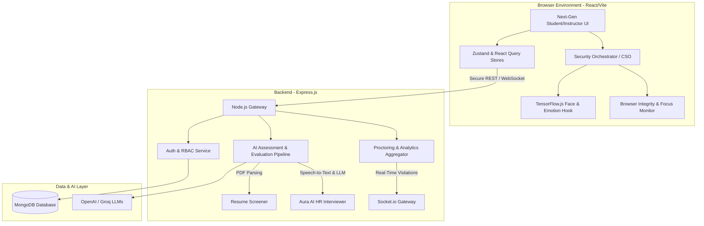
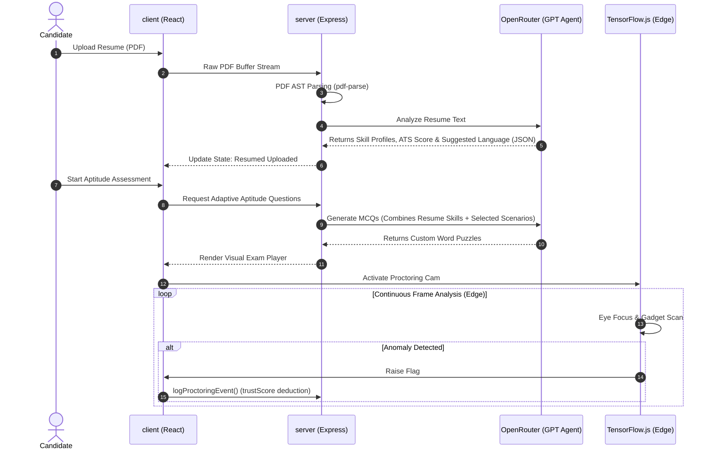

# 🛡️ Next-Gen AI-Proctored LMS & Placement Assessment Suite

An enterprise-ready, production-grade Learning Management System (LMS) and secure recruitment assessment suite. The platform leverages edge-based artificial intelligence for real-time proctoring and emotion recognition, alongside LLM-powered evaluation pipelines to orchestrate a secure, gamified, and multi-stage evaluation experience for students and corporate personnel.

---

## 🚀 Architectural Overview & Tech Stack

This suite is built as a decoupled, high-throughput distributed system comprising a high-performance **React Single Page Application (SPA)** on the frontend and an asynchronous **Node.js + Express** microservices-inspired gateway on the backend.



### 💻 Frontend Architecture (`/client`)
* **Core Framework**: React 18.3 (using Vite 8.0 for near-instant builds and HMR).
* **Styling & UI**: Vanilla TailwindCSS 3.4 for fluid design systems, Framer Motion for premium micro-animations, and Lucide React icons.
* **State Management**: Zustand for global auth and interview states; in-memory caching to bypass redundant fetch routines.
* **On-Edge AI Layer**: TensorFlow.js (`@tensorflow/tfjs`), `@tensorflow-models/coco-ssd` for hardware-accelerated object & gadget recognition, and `@vladmandic/face-api` for deep neural network-driven face/emotion monitoring directly inside the client's WebGL context.
* **Real-time Engine**: Socket.io-client for bi-directional live telemetry, chat, and telemetry synchronization with the instructor dashboard.

### ⚙️ Backend Architecture (`/server`)
* **Runtime**: Node.js utilizing ES Modules.
* **Framework**: Express.js (v5.2.x) with strict global middleware pipelines, custom HTTP error handlers, and Express-Multer buffer stream handlers.
* **Real-time Protocol**: Socket.io for synchronous multi-candidate event streams.
* **Database & ORM**: MongoDB connected via Mongoose for schema validation, automated timestamps, and indexing.
* **Evaluation Pipelines**: 
  * `pdf-parse` for structured resume AST extraction.
  * Integration with OpenAI GPT and Mistral AI API for cognitive aptitude checking, programmatic code validation, and behavioral HR feedback loops.

---

## 🔑 Role-Based Access Control (RBAC) & Authentication Flow

The platform maintains two core flows (Personal Students and managed Institutional Candidates) along with administrative access for Instructors.

| Role | Auth Route | Access Context | Core Workflow |
| :--- | :--- | :--- | :--- |
| **Personal Student** | `/auth` | Direct signup & self-paced testing | MCQ ➔ Resume Upload ➔ Aptitude ➔ Coding ➔ Aura AI Interview ➔ Completed |
| **Institutional Student** | `/auth/institution` | Managed rollout via Roll Number | **Bypasses MCQ stage** ➔ Auto-starts at Resume Upload ➔ Finished |
| **Instructor** | `/auth` | Email contains `instructor` keyword | Manage assessments, seed databases, bulk-import CSVs, print credentials, and review live proctoring violations |

> [!IMPORTANT]
> **Instructor Account Creation Rule:**
> To register an Instructor account, visit the `/auth` page, select "Create an account", and input an email address that **explicitly contains the substring `instructor`** (e.g., `admin.instructor@academy.org`). The backend automatically parses this keyword during registration to provision the `instructor` role.

---

## 🛠️ Security Orchestrator (CSO) & Proctoring Infrastructure

Assessments are protected by the **Unified Security Orchestrator** component, enforcing strict exam integrity through hardware-accelerated webcam feeds and browser sandbox restrictions.

> [!WARNING]
> The proctoring system enforces strict disqualification limits. When candidate violations exceed these limits, the system auto-locks the test and flags the profile as **Disqualified**.

### 🔒 Proctoring Security Policies
1. **Clipboard Isolation**: Completely blocks all copying, pasting, cutting, and right-click context menus (`Ctrl+C`, `Ctrl+V`, `Ctrl+X`, and contextmenu event listeners are overridden and suppressed).
2. **Keyboard Sandbox**: Blocks active browser shortcut keys (`Ctrl+R`, `Ctrl+T`, `Ctrl+W`, `Ctrl+F`, `Ctrl+P`) and halts access to Chrome DevTools (`F12` and `Ctrl+Shift+I`).
3. **Tab-Switching / Focus Detection**: Triggers a **Critical Violation** when the student switches tabs or blurs the browser window.
   * **Max Attempts Allowed**: `2`
   * **Limit Exceeded**: Automatic candidate disqualification.
4. **Fullscreen Lockdown**: Instantly forces the browser into full-screen mode on exam initiation. If the student exits fullscreen, a modal overlay blocks interaction, demanding immediate re-entry.
   * **Max Attempts Allowed**: `2`
   * **Limit Exceeded**: Automatic candidate disqualification.
5. **Real-Time AI Camera Proctoring**: Uses the browser's webcam context via TensorFlow.js to continuously track:
   * **Violations**: Eye focus deviation (looking away), face hidden/missing, multiple faces detected in frame, and gadget detection (smartphones/tablets).
   * **Max Attempts Allowed**: `4`
   * **Limit Exceeded**: Automatic candidate disqualification.

---

## 🎓 Dashboards & Features Walkthrough

### 1. Student Dashboard (`/student`)
The student portal adapts dynamically to show assigned assessments, overall performance accuracy, accrued coding XP, and progress badges.
* **Self-Paced Progression**: Visualizes completed stages. Failed exams (scores below 70%) trigger the **Revision System**, rendering customized flashcards and focused reading logs to address weak areas.
* **Institutional Reports**: Institutional students receive direct visual summaries for their Aptitude, Coding, and HR Interview scores, along with deep, personalized AI feedback.
* **Assessment Bypass Toggle**: Allows developers and instructors testing the platform to toggle **Bypass Mode** which temporarily disables proctoring checks across test modules.

### 2. Exam Player Stage (`/exam-player`)
A clean, focused environment where the MCQ round is delivered. It has strict security hooks, automated timers, exam navigation panels, and embedded revision cards.

### 3. Resume Screener (`/student/resume`)
* **AI Analysis**: Candidates upload a PDF resume. The backend parses the raw text and runs an LLM parser to extract technical skills, experience metrics, project quality, and provides a placement suitability verdict.

### 4. Cognitive Aptitude Sandbox (`/student/aptitude`)
* **Adaptive Testing**: Tests problem-solving speed, numerical logic, and verbal reasoning. Custom metrics measure speed per question and difficulty levels.

### 5. Multi-Language Code Lab (`/student/coding`)
* **Interactive IDE**: Embedded Monaco-like editor supporting multiple languages (JavaScript, Python, C++, Java).
* **Test Case Executor**: Submits code to a sandboxed backend `/compiler` endpoint to execute code against pre-configured and hidden test cases, returning detailed memory and time metrics.

### 6. Aura AI HR Interview Simulator (`/student/interview`)
* **Interactive HR Chat**: A premium audio-visual portal. The user is greeted by an interactive AI avatar.
* **Real-time Speech Recognition**: Integrates real-time speech-to-text processing for spoken answers.
* **Emotion Dashboard**: Continuously tracks candidate emotions (happy, sad, neutral, stressed, surprised) to generate a behavioral report for the final recruitment matrix.

### 7. Instructor Portal (`/instructor`)
The command center for administrators and HR teams.
* **Main Dashboard (`/instructor`)**: Complete statistics of all students, average assessment scores, and active assessments.
* **Live Analytics (`/instructor/analytics`)**: Generates beautiful, interactive charts mapping candidate scores, average accuracy, and completion statistics across rounds.
* **AI Assessment Generator (`/instructor/generate`)**: A highly sophisticated tool where instructors input a topic and parameters, and the AI backend instantly builds structured MCQs, programming tests, or behavioral interview templates.
* **Candidate Roster & Bulk Seeding (`/instructor/institution-users`)**:
  Allows bulk student onboarding using CSV file structures.
  ```csv
  username,institutionId,email
  John Doe,MIT-2026,john.doe@mit.edu
  Jane Smith,MIT-2026,jane.smith@mit.edu
  ```
  *The system auto-hashes a customized default password, configures their account at the `RESUME_UPLOAD` stage (bypassing MCQ), and keeps a plain-text display password so instructors can easily export and print candidate access sheets.*
* **Audit & Performance Reports (`/instructor/performance-reports`)**:
  Provides a comprehensive audit trail of every candidate's assessment history. Instructors can inspect exact proctoring violation logs (timestamps and violation severity), view generated emotion charts, read AI-generated placement reports, and manually issue **Hired** or **Rejected** states to candidates.

---

## 🛠️ Production Installation & Development Setup

### System Prerequisites
* **Node.js**: `v18.x` or higher
* **MongoDB**: Standard server or MongoDB Atlas cluster
* **API Keys**: OpenAI Developer Key and Apify API Key

---

### Step 1: Clone and Configure Environment

Create a `.env` file inside the `/server` directory:

```ini
# server/.env
PORT=5000
MONGO_URI=your_mongodb_connection_string
JWT_SECRET=your_production_level_secure_jwt_secret_key_string
OPENAI_API_KEY=sk-or-v1-...  # For LLM-based evaluation & interview modules
APIFY_API_TOKEN=apify_api_... # (Optional) For specialized web data processing
```

Create a `.env` file inside the `/client` directory:

```ini
# client/.env
VITE_API_URL=http://localhost:5000
VITE_TEST_MODE=false
```

---

### Step 2: Server Installation & Bootup
```bash
# Navigate to the server root
cd server

# Install verified dependency tree
npm install

# Boot backend server in hot-reloading development mode
npm run dev

# Or start in production mode
npm start
```
*The server will boot on port `5000` and establish a connection to your MongoDB instance.*

---

### Step 3: Client Installation & Bootup
```bash
# Navigate to the client root
cd ../client

# Install frontend libraries
npm install

# Start Vite high-speed development server
npm run dev
```
*The client dev server will spin up on `http://localhost:5173`. Open your browser to begin testing.*

---

### Step 4: Verification & Build
To verify the application for production deployment, run the bundler check:
```bash
cd client
npm run build
```
Vite will compile and package static client assets under `/client/dist` in less than 3 seconds, confirming complete build integrity.

---

## 🐳 Production Deployment Suggestions
1. **Frontend Hosting**: Deploy the `/client/dist` static assets to **Vercel**, **Netlify**, or an **AWS S3 Bucket** served via CloudFront. Ensure that fallback routing redirects all routes to `index.html`.
2. **Backend Hosting**: Deploy the `/server` Node app to a platform supporting WebSockets (such as **Render**, **Heroku**, or a **VPS like DigitalOcean/AWS EC2**).
3. **Database**: Use a hosted cluster like **MongoDB Atlas** for high-availability database performance.

---

## 🤖 Deep-Dive: AI Architectural Pipeline & Orchestration

The platform integrates edge-based artificial intelligence, asynchronous web scrapers, and large language model (LLM) agents to automate candidate verification and evaluation.

```
+-----------------------------------------------------------------------------------+
|                                ASSESSMENT LIFE CYCLE                              |
+-----------------------------------------------------------------------------------+
|  1. Ingest      |  2. Adapt        |  3. Monitor      |  4. Solve      |  5. Audit|
+-----------------+------------------+------------------+----------------+----------+
|  PDF Resume     |  Custom Aptitude |  Face/Object     |  Monaco IDE    |  Live PDF|
|  Scraped YT URL |  Adaptive Coding |  TensorFlow Edge |  Sandbox Exec  |  AI Coach|
+-----------------------------------------------------------------------------------+
```

### 🔌 AI APIs & Core Technologies utilized

1. **OpenRouter AI Gateway (OpenAI GPT Models)**
   * **Base URL**: `https://openrouter.ai/api/v1`
   * **Primary LLM**: `gpt-4o-mini` (for real-time structured JSON schema generation, programming aptitude validation, HR evaluations, and personalized study roadmaps).
   * **Vision Agent**: `gpt-4o` (for processing image uploads during assessments, extracting textual diagrams, and evaluating visual flowchart elements).
2. **Apify Scraper Engine (`bernardo/youtube-transcript-scraper`)**
   * Processes instructor-provided video links asynchronously.
   * Extracts clean, structured plain-text subtitles and timing logs for prompt context seeding.
3. **Carbonara Visual Compiler (`https://carbonara.vercel.app/api/cook`)**
   * Converts generated code templates into premium, beautifully styled Dracula-themed screenshot cards displayed within the Exam Player UI.
4. **TensorFlow.js (Client-Side Edge AI)**
   * **`@vladmandic/face-api`**: Runs in the client's WebGL context, tracking face landmarks and mapping facial expressions (Happy, Sad, Neutral, Surprised, Stressed).
   * **`@tensorflow-models/coco-ssd`**: Performs object detection inside the candidate's camera viewport to identify prohibited items (phones, tablets, external screens).

---

## 🖥️ AI Workflow Steps Across Dashboards

Here is the exact step-by-step pipeline executed by our AI agents as a candidate navigates the system:



### 1. Student Personal Dashboard Workflow

#### Phase A: Resume Scanning & ATS Profiling
* **Step 1:** The student uploads a PDF resume.
* **Step 2:** The backend uses `pdf-parse` to extract the raw text content.
* **Step 3:** The parser sends the clean text to `gpt-4o-mini` with a strict JSON format rule.
* **Step 4:** The AI extracts skills, formatting quality, project achievements, suggestions for improvement, and computes an overall **ATS Score**.
* **Step 5:** The AI selects a **Primary Programming Language** based on projects and experience.

#### Phase B: Context-Aware Aptitude Seeding
* **Step 1:** The system checks the parsed resume skills and selected test scenarios (e.g., Logical Reasoning, Computer Science, Communication).
* **Step 2:** The AI generates custom, challenging aptitude problems. If the resume features "React.js" and the scenario is "Logical Reasoning", the AI builds a puzzle based on component rendering sequences.
* **Step 3:** Questions with programming logic are processed by the Carbonara API to render styled code snippets.

#### Phase C: Sandboxed Code Lab Evaluation
* **Step 1:** The candidate starts the Coding Round in the dynamic Monaco IDE.
* **Step 2:** The system generates 4 programming tasks, scaling from Easy (e.g., String Anagrams) to a complex Medium-level task that acts as a logical sequel to previous problems.
* **Step 3:** When code is submitted, the sandbox tests the solution against pre-configured inputs.
* **Step 4:** The AI analyzes code syntax, style conformity, and logic bugs, outputting step-by-step suggestions and asymptotic complexity feedback (e.g., $O(N)$ vs $O(N^2)$).

#### Phase D: Aura AI Speech & Emotion Interview
* **Step 1:** The candidate enters a video-audio HR session.
* **Step 2:** The AI generates 7 interview questions based on the candidate's prior assessment scores (targeting logical gaps and technical weaknesses).
* **Step 3:** During responses, real-time client-side Speech-to-Text transcribes answers.
* **Step 4:** The local TensorFlow Face-API logs an emotional trajectory, mapping confidence levels and stress signs.
* **Step 5:** The AI scores responses on a 0–2 scale, providing communication feedback and next-step career guidance.

---

### 2. Student Institutional Dashboard Workflow

For candidates registered via managed roll numbers:
* **MCQ Bypass Logic:** The AI skips the preliminary MCQ round, routing them straight to Resume Upload to build their skills profile.
* **Consolidated Institutional Analytics:** Telemetry from Aptitude, Coding, and HR Interviews is structured by the AI to build a **Unified Institutional Performance Matrix**.
* **Personalized Gap Analysis:** The AI compares theory capability (from resume credentials) against real-world execution (coding sandbox marks), rendering custom recommendations for further training.

---

### 3. Instructor Admin Portal Workflow

* **Automatic MCQ / Quiz Seeder:** Instructors input a topic or drop a YouTube link. The AI processes video captions via the Apify scraper and programmatically parses them into structured MCQs, including answer explanations and difficulty tags.
* **Roster Proctoring & Fraud Detection:** The portal tracks candidate metrics in real-time. The AI flags candidates with high scores but low trust scores (e.g., score > 90%, trust < 70%), alerting administrators to potential malpractice.
* **Puppeteer Batch Intelligence PDF:** The system generates a PDF summarizing class performance. The AI identifies the module with the highest failure rate, highlights top candidates, and maps out batch-wide training suggestions.
